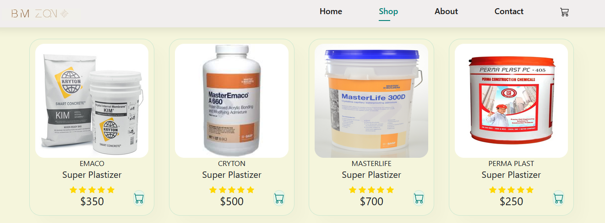
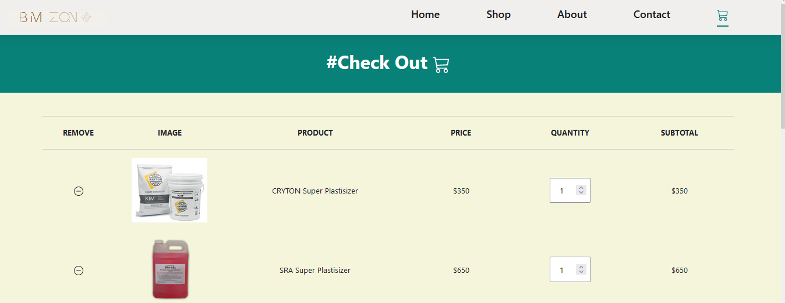

# Construction Material Procurement Web Application (BMZONE)

## Introduction


The construction industry in Egypt faces significant cost overruns due to inefficient material procurement processes for ready-mix concrete plants and contractors. Sourcing and comparing materials that meet specific project requirements is time-consuming and lacks transparency. This often leads to suboptimal material selection, resulting in cost increases and potentially compromised project quality. Existing solutions in the market primarily focus on material databases and pricing information, neglecting the technical aspects of material selection.

Our proposed application bridges this gap by providing a user-friendly platform with a comprehensive database of materials, detailed specifications, pricing information, and advanced search filters tailored to local project needs. Additionally, the application offers a unique consultancy feature that recommends suitable materials based on project requirements (e.g., strength, durability). Users can further connect with qualified professionals through the platform for in-depth consultations. This will empower users to make informed decisions based on project needs, optimize costs, and streamline communication with suppliers. By focusing on user-friendliness, data accuracy, and integration with local suppliers, our application aims to revolutionize the material procurement process and improve project quality in the Egyptian construction industry.
Deployed Site: http://www.ahassanprog.tech/
Final Project Blog Article: https://www.linkedin.com/pulse/bmzone-material-procurement-app-egypt-ahmed-hassan-v7gsc/
Author LinkedIn: https://www.linkedin.com/in/ahmed-hassan-319997316/

## Features

- **Comprehensive Material Database**: Access a wide range of construction materials with detailed specifications and pricing information.
- **User-Friendly Interface**: Easy-to-use platform designed to enhance the user experience.
- **Local Supplier Integration**: Seamless integration with local suppliers for accurate and up-to-date information.






## Technology Stack

- **Backend**: Django
- **Frontend**: HTML, CSS, JavaScript
- **Database**: sqlite

## Installation

### Prerequisites

- Python 3.8+

### Steps

1. **Clone the Repository**
   ```bash
   git clone https://github.com/yourusername/construction-material-procurement.git
   cd BMZONE
   ```

2. **Build and Run the Application Using Docker**
   ```bash
   python manage.py runserver
   ```

3. **Apply Migrations**
   ```bash
    python manage.py migrate
   ```

4. **Create a Superuser**
   ```bash
   python manage.py createsuperuser
   ```

5. **Access the Application**
   Open your browser and navigate to `http://localhost:8000`.

## Usage

1. **Register and Login**: Users can register and log in to the platform to access all features.
2. **Search for Materials**: Use advanced filters to search for materials that meet your project requirements.

## Contribution

We welcome contributions to improve the platform. Please follow these steps to contribute:

1. **Fork the Repository**
2. **Create a Feature Branch**
   ```bash
   git checkout -b feature/your-feature-name
   ```
3. **Commit Your Changes**
   ```bash
   git commit -m 'Add some feature'
   ```
4. **Push to the Branch**
   ```bash
   git push origin feature/your-feature-name
   ```
5. **Open a Pull Request**

## License

The BMZONE is licensed under the terms of the GPL Open Source license and is available for free.

## Related Projects

Material Procurement and Supply Chain Management Systems:

    Bnaia.com is a leading commercial material procurement software solution used in construction. While Bnaia.com offers a comprehensive suite of features, my application focuses specifically on the needs of the Egyptian construction market and provides a more user-friendly interface for material selection based on local availability.
    Khamato.com is an open-source supply chain management platform that offers functionalities like supplier management and inventory tracking. While Khamato.com is broader in scope, some features could be complementary to my application's material procurement focus.

Resources for the Egyptian Construction Industry:

    The Egyptian Construction Materials Information Center (ECMIC) [invalid URL removed] is a valuable resource for construction professionals in Egypt, providing industry news and technical information on construction materials.
    The Construction Federation of Egypt (CFE) [invalid URL removed] is a professional organization representing the Egyptian construction sector. This could be a good platform to connect with potential users of my application.

## Contact

For any inquiries or support, please contact us.
